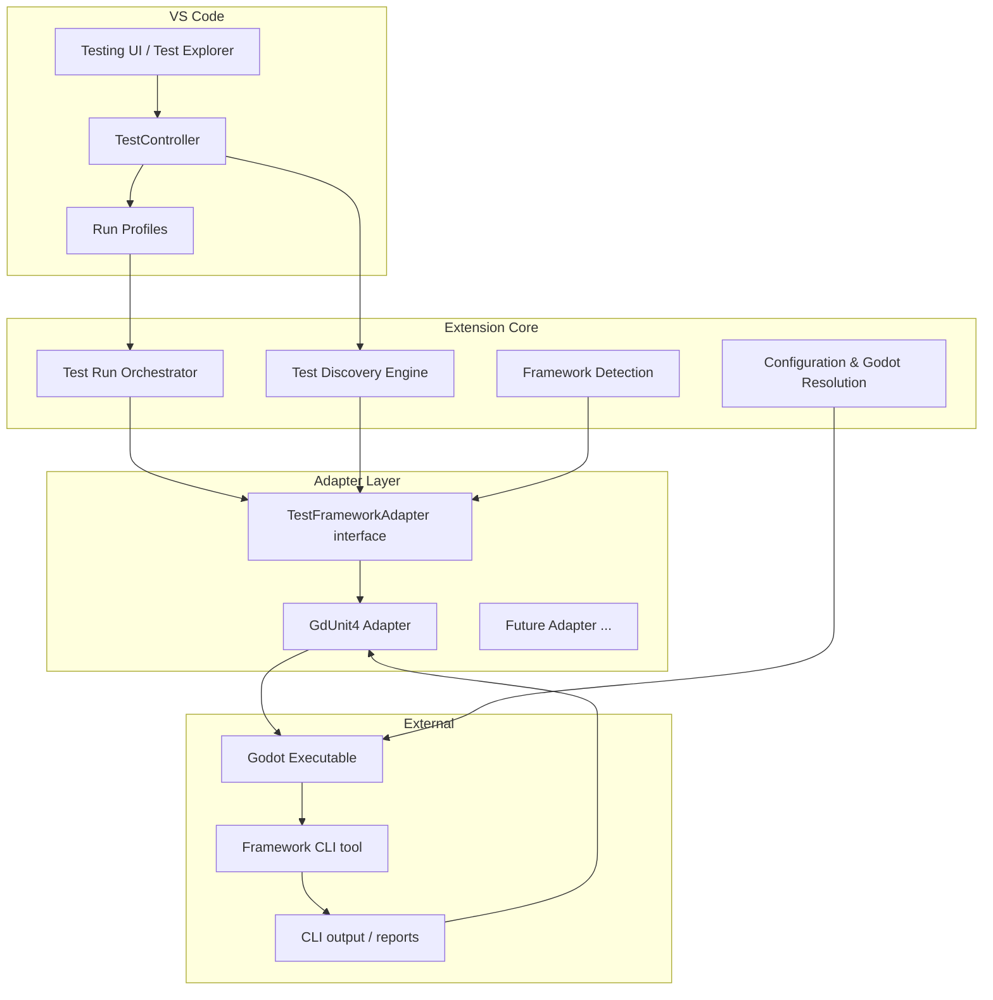

# GDScript Test Runner — Planning (In Progress)

> **Status:** Draft — decisions below are current but subject to change as we learn the APIs and the tooling.
> The existing `src/` is throwaway template/experimentation code and carries no design weight.

## 1. Purpose

A VS Code extension that runs GDScript unit tests. It is a **test runner only**:

- We are **not** responsible for GDScript editing, linting, or error detection.
  Those concerns belong to the Godot executable and third-party extensions
  (e.g. `godot-tools`).
- We **are** responsible for discovering tests, invoking a test framework through
  the Godot binary, and reporting results into the VS Code Testing UI.

## 2. Hard dependencies

1. **Godot Engine executable** — required to parse and run GDScript. A hard
   requirement; not bundled with the extension.
2. **A test framework** — the actual unit-testing library embedded in the project.
   Communicated with through an adapter (see §5).

## 3. Core architecture



## 4. Component responsibilities

### 4.1 Configuration & Godot resolution

- Resolve the Godot executable path:
  1. **Default:** assume `godot` is on `PATH`.
  2. **Override:** read a VS Code setting for an explicit executable path.
- Detect the Godot project root (locate `project.godot`); multi-root aware.
- Expose settings (initial set, TBD):
  - `gdscriptTestRunner.godotExecutable` (path, empty = use `PATH`)
  - report/temp directory if needed later

### 4.2 Test Discovery Engine

- Watch for test files via `vscode.workspace.createFileSystemWatcher`.
- Build the VS Code test tree (`TestItem`s): file → suite → test case.
- Use `TestController.resolveHandler` for lazy per-file parsing.
- Discovery rules are **adapter-provided** (see §5), not hard-coded in the engine.

### 4.3 Test Run Orchestrator

- Owns `TestRunProfile` creation (Run profile; Debug is out of scope for now).
- Translates a `TestRunRequest` into a framework invocation via the adapter.
- Handles `CancellationToken` → terminates the child Godot process.
- Publishes results into the `TestRun` (`run.passed()` / `run.failed()`).

### 4.4 Framework Detection

- Determines which test framework addon is present in the project.
- One adapter per framework library (see §5).
- Detection is adapter-specific and optional to the core flow.

## 5. Adapter layer (`TestFrameworkAdapter`)

The adapter is the seam between the extension core and a specific test framework.
One adapter per library. Proposed interface (subject to change):

```ts
interface TestFrameworkAdapter {
  /** Unique id, e.g. "gdUnit4" */
  readonly id: string;

  /** Human-readable name. */
  readonly displayName: string;

  /** Is this framework present in the given workspace? */
  detect(workspaceRoot: string): Promise<boolean>;

  /** Parse the framework addon's version (optional, for version-gated behavior). */
  detectVersion(workspaceRoot: string): Promise<string | undefined>;

  /** Discovery rules for this framework. */
  readonly discovery: {
    /** File glob / matcher identifying test files, e.g. `**\/test_*.gd`. */
    fileFilter: string;
    /** Extract test case symbols (name, range) from file contents. */
    parseTestCases(content: string): TestCaseDescriptor[];
  };

  /** Translate a TestRunRequest into CLI args for the framework tool. */
  buildRunArgs(request: RunRequestInfo): string[];

  /** Parse execution output into structured per-test results. */
  parseResults(rawOutput: string): TestResult[];
}
```

### GdUnit4 adapter (first target)

- **Detection:** look for `addons/gdUnit4/` in the project (the addon's presence is
  the signal).
- **Version:** parse from the addon's `plugin.cfg` (adapter-specific; optional).
- **Discovery rules (initial, GdUnit4 convention):**
  - File filter: files matching `test_*.gd`.
  - Test cases: functions named `test_*` via a simple regex.
  - Parameterized test discovery is **out of scope for now**.
- **Invocation:** run the GdUnit4 command-line tool
  (`res://addons/gdUnit4/bin/GdUnitCmdTool.gd` via `runtest.sh`/`runtest.cmd`)
  with Godot headless.

## 6. Decisions log

| #   | Topic                                    | Decision                                                                                                                  | Status                  |
| --- | ---------------------------------------- | ------------------------------------------------------------------------------------------------------------------------- | ----------------------- |
| 1   | Discovery approach                       | Simple regex, adapter-provided; GdUnit4 = `test_*.gd` files + `test_*` funcs. Parameterized discovery out of scope.       | Decided                 |
| 2   | Result channel                           | Parse **CLI stdout** for now (guaranteed). JUnit XML only exists if report generation is enabled, so we can't rely on it. | Decided (revisit later) |
| 3   | Godot binary resolution                  | Default `PATH`; VS Code setting for explicit executable path.                                                             | Decided                 |
| 4   | `--check-only` / LSP / other Godot utils | Not needed now, but **not excluded**. Since Godot is a hard dependency, we may use any of its tools if a need arises.     | Open (as-needed)        |
| 5   | Debug-in-test                            | Out of scope for now; may be considered later.                                                                            | Deferred                |
| 6   | Framework detection                      | One adapter per library; adapter-specific detection. GdUnit4 first.                                                       | Decided                 |
| 7   | Addon version parsing                    | Adapter-specific; optional, only for version-gated support.                                                               | Decided                 |

## 7. Open questions / next steps

- [ ] Verify GdUnit4's exact CLI output format so `parseResults` can map it
      reliably (needs a real run against a sample project).
- [ ] Decide the exact VS Code settings schema and names.
- [ ] Confirm multi-workspace / multi-project handling requirements.
- [ ] Determine how to present "no framework detected" vs. "Godot not found" to
      the user.
- [ ] Spike: minimal end-to-end flow (detect Godot → detect GdUnit4 → discover one
      `test_*.gd` → run → parse stdout → report) before building the full adapter
      surface.

## 8. Verified facts (research notes)

- Godot has **no** one-shot "dump symbols to stdout" CLI utility. Options are:
  - `--check-only` — parse a script for errors and quit.
  - `--gdscript-docs <path>` — generates docs from inline `##` comments (only
    documented symbols).
  - `--lsp-port` — full language server (long-running, not one-shot).
  - **Implication:** discovery does not depend on Godot; regex is the right call.
- GdUnit4 CLI (`GdUnitCmdTool.gd`): requires `GODOT_BIN`; `-a` adds suites/dirs,
  `-i` ignores, `-c` continues past failures; return codes `0` success / `100`
  failures / `101` warnings; generates `results.xml` (JUnit) + HTML only when
  report generation is used.
- GdUnit4 v6.x requires Godot 4.5+.
